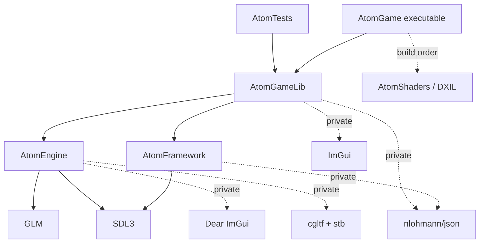
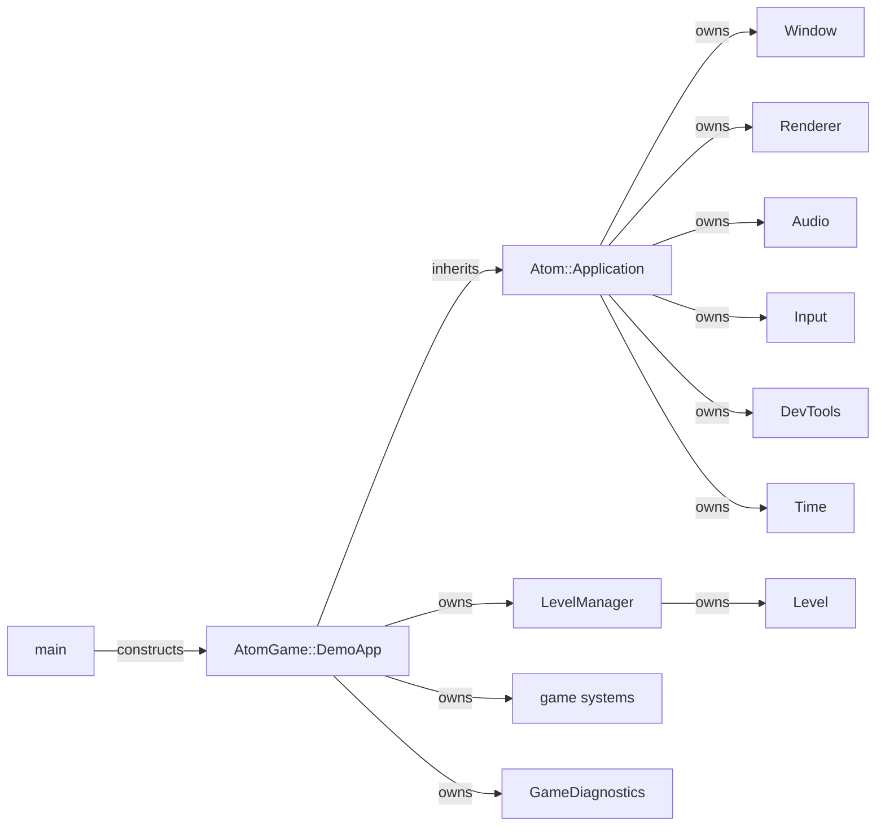
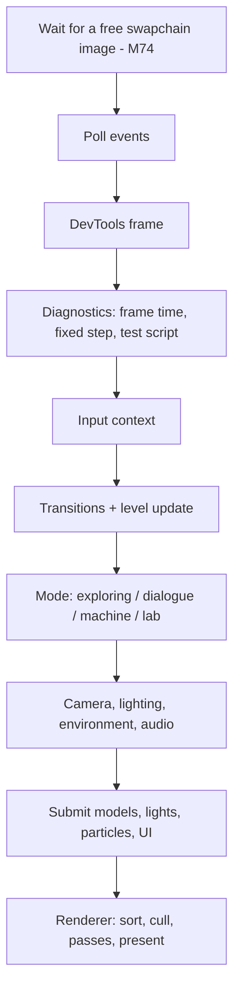
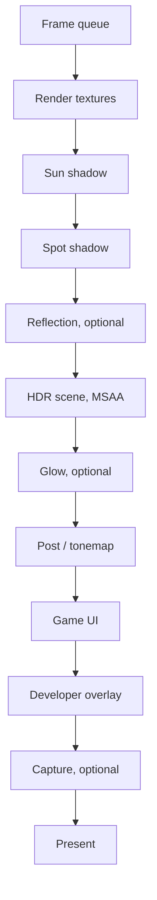
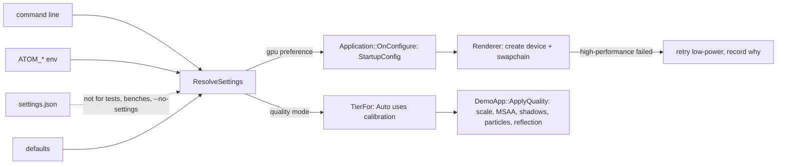
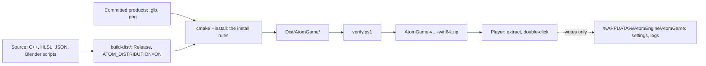

# AtomEngine — Architecture

How AtomEngine is put together, and the rules that keep it that way. The
[technical manual](AtomEngine-Tech-Manual.md) explains *concepts*; this page
explains *structure*. It is maintained (M58):
when a change alters a diagram or a rule here, the change updates this page.

## 1. Targets and dependency direction

```text
AtomGame (exe) ──→ AtomGameLib ──→ AtomFramework ──→ SDL3
                        │
                        └────────→ AtomEngine ──→ SDL3, GLM
AtomTests ───────→ AtomGameLib
```



- **The one rule that matters most:** the engine never includes game code.
  `Engine/` (namespace `Atom`) is reusable; `Game/` (namespace `AtomGame`)
  is the concrete demo.
- **The framework (M76):** `Framework/` (namespace `AtomFramework`) is what
  every game made with AtomEngine shares but the engine doesn't own: the
  run's log (`RunLog`, named per game), the settings model and command
  line (`GameSettings`), the calibration decision. Games link it; they never
  share each other's code. Install rules are per game (a CMake component
  named like the game), so `Tools/Dist/package.ps1 -Game <name>` packages
  any of them.
- **Static libraries** let the tests exercise exactly the game code the
  executable runs.
- **Usage requirements are honest** (M54): PUBLIC only for what a target's
  headers expose (SDL types, GLM maths and its settings); PRIVATE for what
  only its `.cpp` files use (ImGui, JSON, cgltf, stb, the version string).
- **Build options:** `ATOM_BUILD_GAME` (the executable and shaders, needs
  `dxc`), `ATOM_BUILD_TESTS`, `ATOM_BUILD_PRESENTATION_PROBE`. CI builds
  with the game off (§11).

## 2. Application, engine and game: the real layering

There is **no runtime `Engine` object**, and none should be added.



- **`Atom::Application`** is the engine's runtime: the platform loop, the
  owner of every process-lifetime subsystem (window, renderer, audio,
  input, developer tools, time) and the composition root that creates them
  in order. It is not a service locator: there is no global lookup.
- **`AtomGame::DemoApp`** is the concrete game: it derives from
  `Application`, receives its hooks (`OnInitialize`, `OnUpdate`,
  `OnShutdown`) and coordinates the game's systems in an explicit frame
  order. Measurement and scripted tests live beside it in
  `GameDiagnostics` (M57).
- Inheritance keeps the ownership order visible in one place. An `IGame`
  interface or a dependency-injection layer would add indirection without
  solving a present problem.

## 3. Lifecycles

**Start:** `OnConfigure` (settings resolved, adapter chosen - §8) → SDL
video → window → GPU renderer → audio (optional) → ImGui →
`DemoApp::OnInitialize` (asset root, sound library, persistent GPU assets
and fonts, data libraries, the `LevelManager` and the first level,
diagnostics).

**Frame:**



**Shutdown** is the start in reverse: `DemoApp::OnShutdown` releases levels,
game GPU objects and fonts; then the base shuts down ImGui, audio, the
renderer and its device, the window and SDL.

**Levels** own everything level-lifetime (world, collision, models, voices,
screens); persistent progress (flags, counters) lives above them in
`GameState`. A transition loads the next level *before* releasing the old
one, so shared models are reused.

## 4. Renderer

A concrete façade over SDL GPU: resource factory, frame queue and pass
orchestrator. The device itself is a `GPUDevice` the renderer owns:

```text
Application → Renderer (frames, passes, resources) → GPUDevice (device + presentation) → SDL GPU → D3D12
```

- **`GPUDevice`** owns the SDL device and the window it presents to: the
  adapter choice and the low-power fallback, the window claim, the
  swapchain's composition, present mode and frames in flight, uncapped
  presentation for measuring, and the lost-swapchain abandon path (§8).
  These are device and window concerns, not scene rendering, and they're
  what a future fullscreen, resize or device-recovery change would touch.
  There's no backend interface behind it: SDL is that abstraction
  (ADR-001).
- **`Render()`** stays the frame coordinator: render textures, shadows,
  reflection, scene, glow, post, UI, capture, present.



- **Immediate submission:** each frame the game pushes references (meshes,
  materials, chunks, lights, particles); `Render()` sorts, culls, draws and
  clears the queue. The renderer never walks the game's world, and keeps no
  second copy of it. Protect this boundary.
- **Pipelines** are created lazily per variant (samples, culling, alpha to
  coverage, skinning, rain - M52).
- **Known pressure:** `Renderer.cpp` holds every pass. The plan is to move
  one pass's state and code into a private helper *when that pass next
  changes* (audit RENDER-001) - not a render graph, not an RHI.

## 5. GPU resource lifetime

`Mesh` and `Texture` free their SDL resources through a raw, non-owning
device pointer; `RenderTexture` unregisters through a raw `Renderer*`.

**Rule: every GPU wrapper must be destroyed before the renderer shuts
down.** It is checked, not just documented (M53): wrappers count themselves
in `GpuResources`, and `Renderer::Shutdown` reports anything still alive
(and any registered render texture) before destroying the device - and
asserts in Debug. Scenarios fail on that report.

Ownership stays unique (`unique_ptr` by the semantic owner; `shared_ptr`
only for models shared through `ModelCache`).

## 6. World

There is no general engine scene. A `Level` owns a `GameWorld`: a slot map
of entities - a name and transform plus optional capabilities (renderable,
interactable, animated, animator) - addressed by generation-checked
handles. Bulk static geometry is model parts and chunks, not entities.
Keep it that way; it is not an ECS and doesn't need to be (ADR-003).

## 7. Assets: source and product

| Kind | Where | Made by |
|---|---|---|
| **Source** | `Tools/Blender/*.py`, hand-written JSON (levels, dialogue, presets, machines, data) | people |
| **Intermediate** | `build/bake_cache/` | the Blender build (not committed) |
| **Product** | `Assets/**/*.glb`, `*.png`, `*.markers.json` (committed), DXIL (`build/…/shaders`) | Blender, headless and deterministic; `dxc` |
| **Runtime payload** | the folder list in `Game/CMakeLists.txt` (all of `Assets/` but `Schemas/`) | copied next to the executable (M56) |
| **CPU / GPU representation** | parsed level, model, material data; meshes and textures | the loaders, synchronously |

Loading is synchronous and fused (`Model::Load` parses, decodes and
uploads); every level load logs its time and where it went (M57). Split CPU
from GPU loading only when a measured hitch or a tool needs it.

**What a player's machine needs (M66).** A git submodule is not a
runtime dependency; most of them disappear into the executable:

| Class | What | Reaches the player as |
|---|---|---|
| **Compile-time only** | GLM, nlohmann/json, cgltf, stb (headers or compiled-in sources), Dear ImGui (a static library), the MSVC C++ runtime (linked statically) | code inside `AtomGame.exe` |
| **Runtime library** | SDL3 | `SDL3.dll`, the only DLL shipped |
| **Operating system** | Direct3D 12, DXGI, Win32 (kernel32, user32, gdi32, shell32, winmm, imm32, ole32, …) | already on Windows 10/11 |
| **Runtime asset** | the shipped asset folders, DXIL shaders | files beside the executable |
| **Authoring tool** | Blender and `Tools/Blender`, Python, `dxc` | nothing: their products are committed or built |
| **Development tool** | CMake, Visual Studio, doctest, `PresentationProbe`, `SwapchainMatrix`, `Tools/Perf`, `Tools/Dev`, PIX / RenderDoc | nothing |
| **Distribution metadata** | `LICENSE.txt`, the third-party notices (MIT, zlib, OFL) | text files in the package |

The C++ runtime used to be a DLL dependency (`VCRUNTIME140`, `MSVCP140`,
and the `api-ms-win-crt-*` set) that a PC without the Visual C++
Redistributable doesn't have. Since M66 every target links it statically
(`CMAKE_MSVC_RUNTIME_LIBRARY`, set before the first target so nothing mixes
runtimes), SDL3.dll included.

## 8. Hardware and settings

Two decisions are kept apart: **which adapter** (a stability choice, made
once before the device exists) and **how much to draw** (a quality tier,
applied live). Mixing them was the trap: "the fast GPU" is not "high
quality", and on a hybrid laptop it can be the unstable one.



- **Precedence:** command line > `ATOM_*` > saved file > defaults
  (`low-power`, `High`). All of it is pure (`Game/Settings/`) and
  unit-tested; a bad file yields the defaults.
- **Before the device:** `Application::OnConfigure()` lets the game fill a
  `StartupConfig` before the renderer exists - the only point where the
  adapter can be chosen. Changing it later means a restart; there is no
  in-process device rebuild.
- **Tiers cap, they don't force:** a tier only turns existing switches off
  (the reflection stays a level's choice under High). No renderer feature
  exists for one tier only.
- **Failure:** at start-up two steps can fail separately - creating the
  device (which picks the adapter) and claiming the window (which creates
  the swapchain). On the development laptop the RTX device is created and
  only its swapchain for the built-in panel is refused. Either way,
  high-performance falls back to low-power before any resource exists,
  and `StartupFallback` records the stage, adapter and error. Mid-run, a lost swapchain calls
  `OnRenderFailure`; the game saves a low-power fallback, and the device is
  *abandoned*, not destroyed - releasing it on that path corrupted SDL's
  heap - and the process exits with code 3.
- **Calibration** is a measured run over fixed views; its decision
  (`DecideCalibration`) is pure. Records carry the adapter and resolution
  and are dropped when those change.
- **Frames in flight: 2, and the swapchain wait before input (M74),**
  decided on measured input latency. Click to display (PresentMon, 144 Hz
  panel, Iris Xe): 3 frames 36 ms, 2 frames 30 ms, 2 frames with the wait
  moved before input 24 ms, all at 144 fps. In SDL's D3D12 backend the
  frames-in-flight limit also sizes the swapchain (`SDL_gpu_d3d12.c`).
  v0.0.10 chose 3 because 2 then ran at ~72 fps with vsync, under an older
  Intel driver. So, with vsync and the default 2, the renderer checks the
  frame interval once after a warm-up and moves to 3 if 2 can't hold the
  refresh (`NeedsThirdFrame`). `ATOM_FRAMES_IN_FLIGHT` and
  `ATOM_LATENCY_WAIT=late` override; calibration measures at the player's
  setting. Latency is measured by `Tools/Perf/latency.ps1`: the engine's
  stages unprivileged, PresentMon end to end.

## 9. Distribution

AtomEngine manufactures a standalone game: a ZIP a player extracts and
double-clicks, with no repository, compiler, Python or Blender involved.



- **One definition of what ships:** the install rules in
  `Game/CMakeLists.txt` (M68). They install the executable, `SDL3.dll`,
  the shaders, the shipped asset folders (`ATOM_SHIPPED_ASSETS`; the
  development-only `ATOM_DEV_ASSETS` stay out), the licences, and a
  players' README. `verify.ps1` reads its expectations from those same
  lists. What the machine needs at runtime is §7's table.
- **Paths:** assets and shaders resolve from the executable's folder
  (`SDL_GetBasePath`), never the working directory or the repository;
  `ATOM_ASSET_ROOT` is an explicit development opt-in.
- **Ownership:** the package is read-only. Everything a run writes goes
  to the per-user folder: settings, calibration, logs (§8, M67).
- **Two builds from one source:** `build/` for development (console,
  Debug and Release, tests) and `build-dist/` for players (windowed,
  Release, no tests). They differ only in `ATOM_DISTRIBUTION`.
- **Checked:** locally by `Tools/Dist/package.ps1`, which also starts the
  package from outside the repository, and on pull requests and pushes to
  master by CI's `package` job (M69), a check that keeps no ZIP. A clean-machine run follows
  [Distribution-Test.md](Distribution-Test.md).

**What ships, and how (M70, revised in M82).** The player keeps what helps a
stranger report a problem; every developer facility is compiled out.

| Facility | Policy |
|---|---|
| The log file, `--diagnostics`, the start-failure message box | **always available** |
| F10 developer panels, the shared F1 overlay (every game) | **development only**: compiled out (`ATOM_DEV_TOOLS=0`) |
| The demo's F2–F8 display toggles | **shipped**: plain game keys |
| `ATOM_*` switches, the scenario harness (`ATOM_TEST_SCRIPT`), `bench`, `screenshot`, PERF and LAT logs, DRIFT's autopilot | **development only**: `Atom::DevSwitch` reads nothing in a package |
| Hot reload (`ATOM_ASSET_ROOT`) | **development only**: needs the source tree |
| Asserts, the D3D12 debug layer | **Debug only**: compiled out of Release |
| The character lab (`Lab/`, `ThirdParty/`, its level) | **not packaged**: its character's licence isn't recorded |
| `Tests/`, `PresentationProbe`, `SwapchainMatrix`, `Tools/Perf`, `Tools/Dev`, Blender tools, schemas | **not packaged** |

M82 reverses M70's "nothing stripped": `-DATOM_DISTRIBUTION=ON` also defines
`ATOM_DEV_TOOLS=0`. The cost is that the shipped executable is not byte for
byte the tested one; the switch gates only entry points (environment reads,
ImGui start-up), so game code paths are the same. The log says which:
"Developer tools: off (distribution build)", and `package.ps1` refuses a
package that says "on".

## 10. Tools

- **Runtime:** Dear ImGui panels (F10) and the F1 overlay (M82: shared by every game, engine lines first, then the game's) - an overlay, not
  an editor framework, and kept out of captures.
- **Scripted:** `.atomtest` scenarios, paired benches, captures - compiled
  in, switched on by the environment.
- **Offline:** Blender scripts, documentation captures, `ab.ps1`.
- **External:** PIX, Intel GPA, RenderDoc for per-pass GPU timing (SDL GPU
  has no GPU timers).

## 11. Verification layers

| Layer | Runs where | Catches |
|---|---|---|
| Unit and authoring tests (`ctest -LE scenario`) | locally and in **CI** on pull requests and pushes to master | logic, parsing, content errors; a clean clone that doesn't build |
| In-game scenarios (`ctest -L scenario`) | locally (needs a GPU) | gameplay, rendering, transitions, leaks of voices and GPU resources |
| Paired benches, `ab.ps1` | locally, plugged in | performance changes - never a CI gate |

## 12. Architecture decision records

### ADR-001 — SDL3 GPU is the renderer abstraction
**Decision:** use SDL GPU types directly; no internal RHI. **Why:** SDL GPU
already owns backend selection; a layer on top would map one to one.
**Revisit when** a needed API or platform can't be served through SDL GPU.

### ADR-002 — Static engine/game composition
**Decision:** ordinary CMake targets and static links; no plugins, Gems or
dynamic modules. **Revisit when** features must be distributed or loaded
without relinking.

### ADR-003 — Keep the slot-map world
**Decision:** `GameWorld` with optional capabilities; add small indices only
where profiling asks. **Revisit when** entity or query counts make iteration
measurably expensive.

### ADR-004 — Committed GLB/PNG are runtime products
**Decision:** commit deterministic products, so a clone runs without
Blender; the bake cache and GPU-tuning bakes are never shipped truth.
**Revisit when** product size or content merge conflicts become a measured
problem.

### ADR-005 — New libraries need a trigger
**Decision:** no migration by default. Each adoption needs a written unmet
capability, a baseline, a prototype and a rollback path. **Revisit** per the
table below, never as a bundle.

### ADR-006 — Low-power by default; the GPU choice is not a quality setting
**Context:** every release up to 0.0.9 hardcoded the low-power adapter -
on the development hybrid laptop (Iris Xe + RTX 4060) moving the window
between displays wired to different GPUs lost the swapchain. Measured in
0.0.10: there, Direct3D 12 refuses a swapchain on the RTX for the built-in
panel (`DXGI_ERROR_DEVICE_REMOVED`, also in a raw D3D12 probe), while the
RTX presents to an external monitor wired to it. **Decision:** keep
`low-power` the default; offer `high-performance` as a preference that
falls back to low-power at creation and, after a mid-run loss, on the next
launch. Quality is a separate tier, defaulting to `High` (0.0.9's look).
Calibration is opt-in. **Rejected:** scoring GPUs by name, a hardware
database, continuous adaptive quality, changing the power plan, rebuilding
the device in-process, a launcher. **Revisit when** a device rebuild is
needed for something else (then a live adapter switch costs little), or
when the default adapter proves wrong on hardware other than hybrid
laptops.

**Addendum (after 0.0.10): the RTX can't present to the panel at all.**
On the development laptop (HP, muxless Optimus: the panel is wired to
the Iris Xe only), no program can put an RTX image on the built-in panel
through Windows' hybrid path. Each possible cause was ruled out in turn
(`Tools/PresentationProbe/SwapchainMatrix.cpp` reproduces it):

| Ruled out | Evidence |
|---|---|
| AtomEngine's code | a raw D3D12 probe, without SDL, fails the same way |
| SDL | 3.4.16 and 3.4.18 alike; SDL's error says "success (0x00000000)", the probe gets `0x887A0005` |
| The swapchain kind | flip discard and sequential, bitblt, 2 or 3 buffers, BGRA or RGBA: all fail on the RTX, all work on the Iris |
| The API | D3D11 fails too when the RTX is chosen explicitly |
| NVIDIA's opt-ins | the `NvOptimusEnablement` export, and a per-program NVIDIA profile: no effect on D3D12 |
| The launching session | the same from the user's own terminal |
| The Intel driver | 32.0.101.6790 → 7092 (the newest for this chip; Intel's main driver no longer lists it): no change |

A D3D11 game (*The Evil Within*) does render on the RTX and show on the
panel, through NVIDIA's older per-game Optimus path, which D3D12 lacks.
So this is the laptop's hybrid-display stack, not something an engine
can work around. It confirms the decision: low-power by default,
high-performance as an opt-in that falls back and says which step failed
(`GPUDevice`, §4). On this machine the RTX is testable on an external
monitor wired to it.

## 13. When to add what

| Architecture or library | Not yet, because | Reconsider when |
|---|---|---|
| ECS | slot-map capabilities solve identity and composition | entity or query scale is measured as painful after small indices |
| Job system | the main thread meets current needs | profiles show independent workloads that standard facilities can't run |
| Custom RHI | SDL GPU is the abstraction (ADR-001) | a required API or platform is out of SDL GPU's reach |
| Render graph | the passes are few, fixed and readable | configurable topology, or repeated resource-hazard defects |
| Plugin / module system | one statically composed product | features must ship or load independently |
| Asset database | paths, schemas and committed products work | dependency tracking, moves or platform variants become a measured bottleneck |
| Async loading / CPU-GPU model split | level loads take ~0.2 s and have no budget | a measured load misses a stated budget, or a headless tool needs models |
| fastgltf | cgltf loads every shipped feature | parse time, diagnostics or an unsupported glTF feature fails a requirement |
| meshoptimizer / gltfpack | no size, load or vertex bottleneck is proven | representative assets miss a measured budget |
| Jolt Physics | 3D needs are static queries; 2D pachinko physics is its own | dynamic 3D bodies, constraints, ragdolls or vehicles enter scope |
| miniaudio | the SDL mixer covers synthesis, WAV, 3D, reverb, capture | streaming, codecs or complex routing exceed it |
| Scripting | data and C++ iteration suffice | non-programmers need runtime behaviour iteration |
| Reflection | parsers and schemas are explicit | many types need shared serialization or editor inspection |
| Custom allocator | no allocation problem measured | profiling shows contention or fragmentation |

**Rejected now:** an ECS framework, plugins, an RHI, a render graph, a
reflection system, dependency injection or a service locator, an event bus,
a job system or custom allocators, scripting, an asset daemon, an editor
framework around ImGui, splitting every engine folder into a library, and
library migrations without their trigger.
